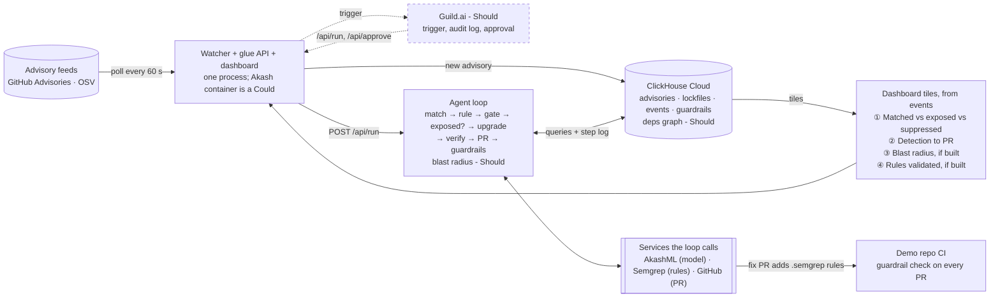
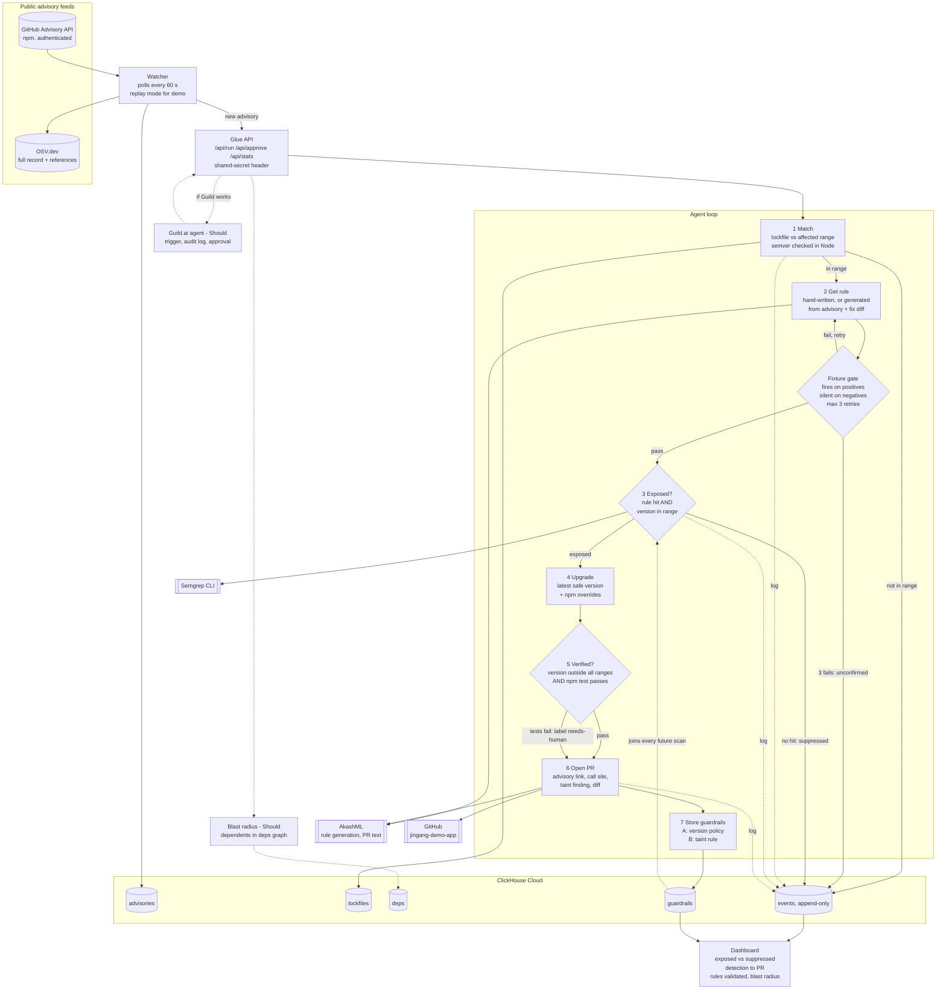

# jingang

An autonomous agent that finds which new vulnerabilities actually reach your code, ships the fix, and guards the gate so they can't come back.

Jingang (金刚) watches public advisory feeds, confirms whether your code actually calls the vulnerable function, ships a verified upgrade as a pull request, and leaves two guardrails behind so the same bug can't come back.

> Dependabot tells you a library is old. Jingang tells you line 12 calls the vulnerable function with user input, ships the fix, and blocks anyone from writing line 12 again.

## Architecture

Two views of the same loop: the overview first, the detailed flow for building underneath. Dotted parts (Guild, blast radius) are Should items the loop works without.

### Overview



### Detailed flow



## Install

Needs Node 22+, the Semgrep CLI, a ClickHouse you can reach over HTTP, and a local clone of the demo app next to this repo.

```bash
git clone https://github.com/g7xu/jingang-demo-app ../jingang-demo-app && (cd ../jingang-demo-app && npm install)
npm install
cp .env.example .env
npm run schema
```

With only the `CLICKHOUSE_*` variables set, AkashML text is templated and the PR step writes its body to `out/` instead of opening a pull request. Add keys to `.env` to switch each step live; see [Configuration](docs/reference/configuration.md).

## Run

Replay one real advisory through the whole loop against the demo app:

```bash
npm run replay -- GHSA-fvqr-27wr-82fm
```

For a clean recording, wipe earlier runs first and replay the suppressed advisories before the exposed one, so no stored guardrail from a previous run colours the first tiles:

```bash
npm run schema -- --reset && npm run replay -- GHSA-35jh-r3h4-6jhm && npm run replay -- GHSA-p6mc-m468-83gw && npm run replay -- GHSA-fvqr-27wr-82fm
```

Start the dashboard and API on http://localhost:8787, then poll the GitHub Advisory API live:

```bash
npm run api
```

```bash
npm run watch
```

## Documentation

- [Proposal & architecture, v2.4](docs/prd.md): the current spec. Loop definitions, rules and fixtures, ClickHouse data model, scope and checkpoints, demo script.
- [Configuration](docs/reference/configuration.md): every environment variable, with what happens when it is empty.
- [Data freshness](docs/explanation/data-freshness.md): why a run re-fetches its inputs instead of reading stored rows.

## Status

Hackathon build, Oct 9, 2026. The Must path runs end to end in dry mode; Guild, the rule generator and blast radius are not built.

## License

[Apache-2.0](LICENSE)
