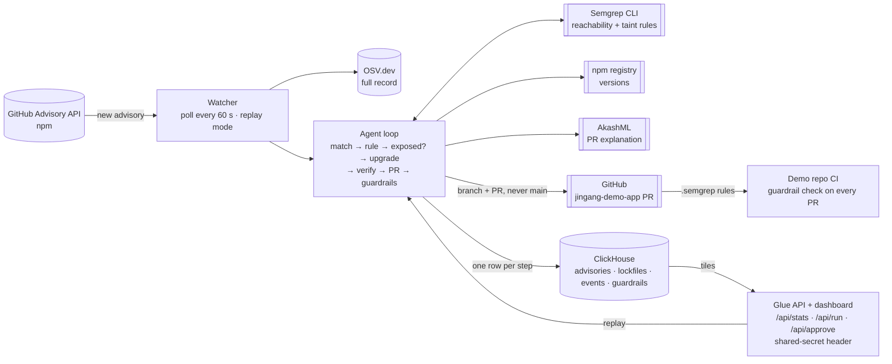

# jingang

An autonomous agent that finds which new vulnerabilities actually reach your code, ships the fix, and guards the gate so they can't come back.

Jingang (金刚) watches public advisory feeds, confirms whether your code actually calls the vulnerable function, ships a verified upgrade as a pull request, and leaves two guardrails behind so the same bug can't come back.

> Dependabot tells you a library is old. Jingang tells you line 12 calls the vulnerable function with user input, ships the fix, and blocks anyone from writing line 12 again.

## How it works

One advisory goes through eight steps. Each step writes one row to the `events` table, and the dashboard tiles are counts over those rows.

1. **Watch.** Poll the GitHub Advisory API for npm every 60 s. Replay mode injects a chosen real advisory instead and labels it `replay`.
2. **Fetch.** Get the full record from OSV: package, affected version ranges, references.
3. **Match.** Read the demo app's `package-lock.json`. Installed version inside an affected range means **Matched**; otherwise the run stops.
4. **Rule.** Use the hand-written Semgrep rule for this advisory from `rules/`. No rule means **Unconfirmed** and no PR.
5. **Exposed?** Run Semgrep on the app with that rule plus every stored guardrail. A call site means **Exposed**; none means **Suppressed**, the noise number, and the run stops.
6. **Upgrade.** Ask OSV for every advisory on the package and npm for every version, pick the newest release outside all of them (same major first), add an npm `overrides` entry so transitive copies follow, then `npm install` and `npm test`.
7. **Verify and open the PR.** Lockfile version outside every known range and tests passing means **Verified**; otherwise the PR still opens, labelled `needs-human`. The body carries the advisory link, the call site, the taint finding, the version change and the verify result. AkashML writes only the explanation on top.
8. **Guardrails.** Store a version policy (never back into that range) and the taint rule (request data into a deep merge, on any version). Both run on every later scan, and the taint rule is copied into the app's `.semgrep/` where CI runs it on every PR.

| Term | Means |
| --- | --- |
| Matched | The lockfile has the package at a version inside the advisory's affected range |
| Exposed | Matched and the reachability rule finds at least one call site |
| Suppressed | Matched but no call site; this count is the noise reduction |
| Unconfirmed | Matched but no rule exists for the advisory; no PR |
| Verified | After the upgrade, the lockfile version is outside every known range and `npm test` passes |
| Detection to PR | PR timestamp minus the watcher's detection timestamp |

## Architecture

What is built. The planning diagrams with the optional pieces (Guild, blast radius, rule generator) are in the [PRD](docs/prd.md).



## Install

Needs Node 22+, the Semgrep CLI (`pip install semgrep`), a ClickHouse you can reach over HTTP (locally: `docker run -d --name ch-hack -p 8123:8123 -e CLICKHOUSE_PASSWORD=hack clickhouse/clickhouse-server`), and a local clone of the demo app next to this repo.

```bash
git clone https://github.com/g7xu/jingang-demo-app ../jingang-demo-app && (cd ../jingang-demo-app && npm install)
npm install
cp .env.example .env
npm run schema
```

With only the `CLICKHOUSE_*` variables set, AkashML text is templated and the PR step writes its body to `out/` instead of opening a pull request. Add keys to `.env` to switch each step live; see [Configuration](docs/reference/configuration.md).

## Run

Replay one real advisory through the whole loop against the demo app:

```bash
npm run replay -- GHSA-fvqr-27wr-82fm
```

For a clean recording, wipe earlier runs first and replay the suppressed advisories before the exposed one, so no stored guardrail from a previous run colours the first tiles:

```bash
npm run schema -- --reset && npm run replay -- GHSA-35jh-r3h4-6jhm && npm run replay -- GHSA-p6mc-m468-83gw && npm run replay -- GHSA-fvqr-27wr-82fm
```

Start the dashboard and API on http://localhost:8787, then poll the GitHub Advisory API live:

```bash
npm run api
```

```bash
npm run watch
```

## Documentation

- [Proposal & architecture, v2.4](docs/prd.md): the current spec. Loop definitions, rules and fixtures, ClickHouse data model, scope and checkpoints, demo script.
- [Configuration](docs/reference/configuration.md): every environment variable, with what happens when it is empty.
- [Data freshness](docs/explanation/data-freshness.md): why a run re-fetches its inputs instead of reading stored rows.

## Demo

The target is [jingang-demo-app](https://github.com/g7xu/jingang-demo-app), an Express app pinned to lodash 4.17.4 with a reachable `merge` call on request data at `app.js:12`. Ten real lodash advisories match that version; one is exposed, the rest are suppressed or unconfirmed. The agent opened [this pull request](https://github.com/g7xu/jingang-demo-app/pull/5) by itself: newest safe version, `overrides` for transitive copies, tests passing, taint rule added to `.semgrep/`, explanation written by the model from the facts. A later pull request that merges request data again is [failed by the guardrail check](https://github.com/g7xu/jingang-demo-app/pull/6).

**Isn't this Dependabot?** Dependabot opens a PR for every version match. Jingang shows how many matches are actually reachable, opens a PR only for those, verifies the fix, and leaves guardrails that block the same bug from coming back. The suppressed count on the dashboard is the proof.

## Security

Judges may poke the system itself, so these are deliberate:

- **Secrets live in environment variables only.** `.env` is ignored; `.env.example` lists names. The GitHub token is fine-grained, scoped to the demo app, and reaches git through `GIT_CONFIG_*` environment config, never in a command line or a remote URL.
- **Never pushes to main.** Every change to the demo app is a commit on a new `jingang/<advisory>-<run>` branch and a pull request against the default branch.
- **`/api/run` and `/api/approve` require an `X-Jingang-Secret` header.** With `JINGANG_API_SECRET` empty both return 401. `/api/stats` and `/api/events` are read-only and bind to 127.0.0.1.
- **Model output is untrusted.** The PR's facts (versions, file, line, advisory link) come from data. AkashML writes only the explanation, and that text is rejected if it contains links, HTML, headings, versions or packages the facts do not name, or a claim that the call site was removed. The template is the fallback.
- **The dashboard escapes every value** before it touches the page, since advisory text comes from public feeds.

## Status

Built at the tokens& Cyberdefense Hackathon, San Francisco, Oct 9, 2026, by Guoxuan Xu and V. Sponsors used: ClickHouse Cloud for every table and the dashboard, Semgrep for reachability and the guardrails, Akash (AkashML) for the PR explanation. Not built: Guild.ai (the `/api/approve` endpoint records an event but gates nothing), the rule generator (every demo rule is hand-written), blast radius.

Honest caveats: the demo rules are hand-written and checked on fixtures; the demo trigger is a replayed real advisory with the live poller running beside it; detection to PR is measured from our watcher, not from publication; reachability means the code calls the vulnerable function, and the taint rule adds "with request data", neither proves an exploit.

## License

[Apache-2.0](LICENSE)
