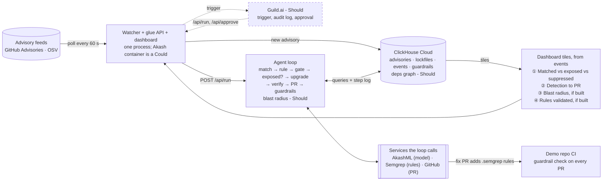
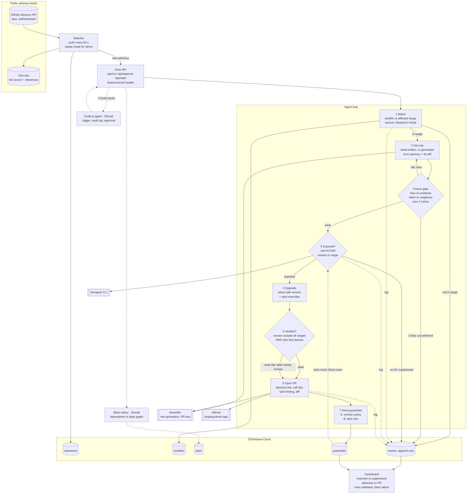

# Jingang v2.4 — Proposal & Architecture

Oct 9, 2026 · @V

## Pitch

Jingang (金刚) watches public advisory feeds, confirms whether your code actually calls the vulnerable function, ships a verified upgrade as a pull request, and leaves two guardrails behind so the same bug can't come back. Jingang is the Chinese name for the Sanskrit *vajra*, the unbreakable thunderbolt, and for the guardian statues at Buddhist temple gates.

**One-liner:** "Dependabot tells you a library is old. Jingang tells you line 12 calls the vulnerable function with user input, ships the fix, and blocks anyone from writing line 12 again."

Every claim in that line is backed by a specific rule in the Rules section: the call by the reachability rule, "with user input" by the taint guardrail, the fix by the version check.

## What changed in v2.4

v2.4 fixes three design bugs in v2.3, corrects facts checked against the real OSV record, and cuts scope to fit one implementer.

| Area | v2.3 | v2.4 | Why |
| --- | --- | --- | --- |
| Name | Patch Patrol | Jingang | Team decision |
| Team | 4 roles (A to D) | 2 people: one implementer, one PRD/architecture/demo owner | Actual team |
| Verify step | Re-scan should find nothing | Lockfile version outside every affected range + tests pass | The call rule still matches after an upgrade, so a re-scan can never come back clean |
| Exposed | Rule fires | Rule fires AND lockfile version is in the affected range | Same reason |
| Guardrail | Store the call rule forever | (A) version policy via npm `overrides`; (B) taint rule: request data into a deep merge | The call rule would flag every future `merge`, even on safe versions |
| Pitch claim | "passes user input into merge" | Backed by the taint rule, not the call rule | The call rule can't see user input |
| Worked example | "Advisory doesn't name the functions" | It does name them; the diff matters for advisories that don't | Checked against the OSV record |
| Fix commit | Follow the FIX reference | Scan all references for `/commit/` URLs; none means text-only generation | This record lists the commit as a WEB link |
| Upgrade target | First fixed version (4.17.5) | Latest version outside all known lodash advisories | Old lodash has several later advisories too |
| ESM imports | Fixture only | Pattern in the rule itself | `import { merge }` produces bare `merge(...)` calls |
| Exploitability | CISA KEV | Dropped for npm; EPSS optional | KEV has almost no npm packages |
| npm download | Full metadata | Compact metadata header | Full metadata can be several MB per package |
| Semver checks | In SQL | In Node over distinct range strings, then SQL | Range logic is awkward in SQL |
| Status storage | Implied updates | Append-only events | ClickHouse is built for inserts |
| Metric name | Time to PR | Detection to PR | Measured from our watcher, not from publication |
| API endpoints | Open | Shared-secret header | Security hackathon; judges may poke them |
| Prior-art claim | "None of these" | "We haven't found one that combines" + Legit Security added | Legit's Sept 30 launch goes advisory to PR |

## Team

One person writes all the pipeline code; everything that can be done in a browser moves to the second person so the implementer never waits.

| Person | Owns | Works in |
| --- | --- | --- |
| Implementer | Watcher, ClickHouse schema and loader, agent loop, Semgrep runs, upgrade + tests, PR creation, AkashML calls, dashboard, Guild if time | Their laptop |
| V (PRD, architecture, demo) | This doc; the demo app files; the hand-written rules and fixtures, validated in the [Semgrep Playground](https://semgrep.dev/playground); README; demo script; video; submission form; judge Q&A | Browser only: GitHub web editor, Semgrep Playground |

**Handoffs from V to the implementer, in order:**

1. `jingang-demo-app` repo with `package.json` (exact pinned versions, no `^`) and `app.js` containing the reachable and unreachable cases. The implementer runs `npm install` once to commit `package-lock.json`.
2. Reachability rule and taint guardrail rule, each tested in the Playground against the fixtures, committed as `rules/*.yaml` in the `jingang` repo.
3. PR body template and the dashboard's number labels.
4. Demo script and recording, with the implementer driving the screen.

## Architecture

Two diagrams of the same system: the overview for the top of the README and the video, the detailed flow for building. Dotted parts (Guild, blast radius) are Should items the loop works without.

### Overview (README top, video)



### Detailed flow (for building)

Paste this one into the README under the overview.



**Differences from the team's v2.3 diagram:** CISA KEV removed; OSV used to fetch the full record and find the fix commit; the exposure and verify decisions use the corrected definitions; two guardrails instead of one; Guild and blast radius drawn as optional; the API requires a shared secret; Akash console hosting dropped from the diagram (Could).

## The loop

Each step writes one row to `events`; the dashboard numbers are counts over those rows, so every number is traceable.

**Definitions (use these words exactly in code, dashboard and demo):**

| Term | Means |
| --- | --- |
| Matched | The lockfile has the package at a version inside the advisory's affected range |
| Exposed | Matched AND the reachability rule finds at least one call site |
| Suppressed | Matched but no call site found; this count is the noise-reduction number |
| Unconfirmed | No rule passed the fixture gate; version-match only, no PR |
| Verified | After the upgrade, the lockfile version is outside every known affected range for that package AND `npm test` passes |
| Detection to PR | PR timestamp minus the watcher's detection timestamp (not the advisory's publish time) |

**Steps:**

1. **Watch.** Poll the GitHub Advisory API for npm (authenticated, so the rate limit is 5,000 requests an hour instead of 60). Fetch each new advisory's full record from OSV. Replay mode injects a chosen real advisory and labels it "replay".
2. **Match.** Read the demo repo's `package-lock.json`; check the installed version against the affected range with the `semver` package in Node.
3. **Get the rule.** Use the hand-written rule if one exists for this advisory; otherwise generate one and send it through the fixture gate.
4. **Exposed?** Run Semgrep with the reachability rule and the stored guardrails. Exposed continues; suppressed is logged and stops.
5. **Upgrade.** Ask OSV for every advisory on this package, pick the newest version outside all of them, and add an npm `overrides` entry so transitive copies upgrade too. Run `npm install` and `npm test`.
6. **Verify.** Check the definition above. Tests failing still opens the PR, labeled `needs-human`.
7. **Open the PR.** Body: advisory link, the call site (file and line), the taint finding if any, the version change, verify results. AkashML writes the plain-English explanation; the facts come from the data, never from the model.
8. **Store guardrails.** Save the version policy and the taint rule; both run on every later scan.

## Rules

Three rule kinds do different jobs: a reachability rule finds calls, a version policy decides exposure and blocks regressions, and a taint rule catches the dangerous pattern on any version. V validates all three in the Semgrep Playground before handing them over.

### Demo advisories: one package, several advisories

Pin an old `lodash` in the demo app. Several real lodash advisories then match at once, but the app calls only `merge`, so one is exposed and the rest are suppressed. That gives an honest noise-reduction number from a single dependency, and one upgrade fixes all of them.

- **Exposed:** [GHSA-fvqr-27wr-82fm](https://api.osv.dev/v1/vulns/GHSA-fvqr-27wr-82fm), prototype pollution in `merge`, `mergeWith`, `defaultsDeep`, fixed in 4.17.5. The advisory text names these functions; for advisories that don't, the generator reads the fix diff.
- **Suppressed candidates:** later lodash advisories for functions the app never calls, such as `template` and `zipObjectDeep`. V confirms their IDs and ranges on OSV before writing rules.

### Reachability rule (finds calls, says nothing about version)

```yaml
rules:
  - id: jingang-ghsa-fvqr-27wr-82fm-call
    message: >-
      Calls lodash $F, which allows prototype pollution in lodash before 4.17.5
      (GHSA-fvqr-27wr-82fm). Exposed only if the lockfile has lodash < 4.17.5.
    severity: ERROR
    languages: [javascript, typescript]
    patterns:
      - pattern-either:
          - patterns:
              - pattern-either:
                  - pattern-inside: |
                      const $L = require("lodash");
                      ...
                  - pattern-inside: |
                      import $L from "lodash";
                      ...
                  - pattern-inside: |
                      import * as $L from "lodash";
                      ...
              - pattern: $L.$F(...)
          - patterns:
              - pattern-inside: |
                  import { $F } from "lodash";
                  ...
              - pattern: $F(...)
      - metavariable-regex:
          metavariable: $F
          regex: ^(merge|mergeWith|defaultsDeep)$
```

If the Playground shows misses for `let` or `var` declarations, add those as extra `pattern-inside` entries.

### Guardrail A: version policy (decides exposure, blocks regressions)

The fix PR adds an npm `overrides` entry so every copy of lodash, including transitive ones, resolves to the safe version the agent picked:

```json
"overrides": { "lodash": "<newest version outside all lodash advisories, chosen by the agent>" }
```

The agent also stores the affected range in `guardrails`. Every later scan fails if the lockfile ever resolves lodash back into that range.

### Guardrail B: taint rule (the class-level guardrail, any version)

```yaml
rules:
  - id: jingang-guard-untrusted-input-deep-merge
    message: >-
      Request data flows into a deep merge ($F). This is how prototype pollution
      happens, on any library version. Strip __proto__ and constructor keys first.
    severity: WARNING
    languages: [javascript, typescript]
    mode: taint
    pattern-sources:
      - pattern-either:
          - pattern: $REQ.body
          - pattern: $REQ.query
          - pattern: $REQ.params
    pattern-sinks:
      - patterns:
          - pattern-either:
              - pattern: $L.$F(...)
              - pattern: $F(...)
          - metavariable-regex:
              metavariable: $F
              regex: ^(merge|mergeWith|defaultsDeep)$
```

This is the rule that makes "line 12 calls the vulnerable function with user input" true.

### Fixtures (run both rules against all four)

| Fixture | Code | Reachability | Taint |
| --- | --- | --- | --- |
| pos-cjs | `const _ = require("lodash");` then `_.merge({}, defaults, req.body)` in a route | fires | fires |
| pos-esm | `import { merge } from "lodash";` then `merge({}, req.query)` | fires | fires |
| const-merge | `const _ = require("lodash");` then `_.merge({}, base, overrides)` | fires | silent |
| neg | `const _ = require("lodash");` then `_.uniq(names)` | silent | silent |

The `const-merge` row is the point of having two rules: the code is exposed on an old version but isn't fed user input.

### Rule generator (Should, after the Must path works)

1. Fetch the OSV record. Scan **all** references for `github.com/.../commit/` URLs, whatever their type; pull the diff. No commit found means generating from the advisory text alone, flagged as lower confidence.
2. AkashML gets the advisory text and diff, and returns the vulnerable function names, a rule, and a positive and negative fixture.
3. Gate: `semgrep --validate` on the rule, then it must fire on the positive fixture and stay silent on the negative one. The negative fixture must import the package. Up to 3 retries with the failure output fed back.
4. Known weakness to state honestly: the model writes both the rule and its fixtures, so both can be wrong together. For demo advisories, also run V's hand-written fixtures; on mismatch, the hand-written rule wins.

## ClickHouse data model

Every table only gets inserts; current status is read with `argMax(status, ts)`, never updated in place.

| Table | Engine | Columns | Notes |
| --- | --- | --- | --- |
| advisories | ReplacingMergeTree(modified) | id, aliases, package, ecosystem, ranges (JSON), details, refs (Array), fix\_commits (Array), modified, detected\_at | Re-inserting a modified advisory replaces the old row |
| lockfiles | MergeTree | repo, commit\_sha, package, version, ts | One snapshot per scan |
| events | MergeTree, order by (run\_id, ts) | ts, run\_id, advisory\_id, repo, step, status, latency\_ms, detail (JSON) | The only source for dashboard numbers |
| guardrails | MergeTree | id, advisory\_id, kind (version\_policy or taint\_rule), package, affected\_range, rule\_yaml, validated, created\_at | Loaded into every scan |
| deps (Should) | MergeTree, order by (dep, package) | package, version, dep, range, is\_latest | Blast radius only |

**Blast radius (Should), built so semver never runs in SQL:**

1. Loader: for the top \~2,000 npm packages, fetch metadata with the header `Accept: application/vnd.npm.install-v1+json` (compact, but still lists every version's dependencies). Insert one row per (package, version, dep, range). Timebox the load to 15 minutes; use whatever count it reaches.
2. On a new advisory, select the distinct `range` strings for that dependency from `deps` (usually a few hundred), test each against the affected range in Node with `semver.intersects`, then count direct dependents in SQL with `range IN (...)` on latest versions.
3. Transitive: repeat the dependents lookup a few hops at package-name level, or use a recursive CTE if a 10-minute test shows the ClickHouse Cloud version supports it.
4. On stage, quote the real numbers: rows loaded, direct and transitive dependents, query latency. Say "millions of edges" only if the row count says so.

**Open question for the implementer (10-minute timebox):** where the top-2,000 list comes from. If nothing quick works, seed from the dependencies of a handful of popular frameworks.

## Sponsor tools

The Must path uses exactly three sponsors, the minimum; Guild is the first Should item so the submission doesn't rest on three.

| Sponsor | Job in Jingang | Tier |
| --- | --- | --- |
| ClickHouse | advisories, lockfiles, events, guardrails, dashboard queries; deps graph for blast radius | Must (graph: Should) |
| Semgrep | Reachability rule, taint guardrail, generated rules through `semgrep --validate` and fixtures | Must |
| Akash (AkashML) | PR explanation text; rule generation | Must |
| Guild.ai | Hosts the trigger, audit log, approval prompt shown once then set to automatic | Should, 30-minute timebox |
| Akash console | Hosts the watcher and dashboard container | Could |
| Senso | Dropped for this build | — |

Pi has no tool; its judges score the general criteria. On the form, tick every sponsor you actually used, and no others. Ask Andy at the front desk whether OpenAI and MongoDB (listed as partners on the event page) count toward the 3+ rule.

## Scope and timeline

One implementer can finish the Must path and maybe two Should items; everything is ordered so stopping at any line still leaves a working demo.

### Must (implementer, in this order)

- [ ] Spikes, 15 minutes: ClickHouse Cloud insert works; one AkashML completion works; the GitHub token opens a test PR on `jingang-demo-app`; `semgrep` runs locally
- [ ] Create the four tables (skip `deps`)
- [ ] Watcher: GitHub Advisory API poll, OSV fetch, replay mode, writes `advisories` and `events`
- [ ] Match the demo lockfile against affected ranges
- [ ] Run V's rules plus stored guardrails with `semgrep --json`; log exposed and suppressed
- [ ] Upgrade: newest safe version from OSV, `overrides` entry, `npm install`, `npm test`, verify
- [ ] Open the PR: V's template plus an AkashML explanation; the PR also adds the guardrail rules to `.semgrep/` in the demo repo
- [ ] Dashboard: matched, exposed, suppressed, detection to PR (a ClickHouse SQL console view is fine if time is short)

### Should (stop starting new items at 15:15)

- [ ] Guild.ai: trigger, audit log, approval prompt once then automatic (30-minute timebox; skip if it doesn't connect)
- [ ] Rule generator with the fixture gate
- [ ] Blast radius over `deps`
- [ ] Regression demo: V opens a PR in the GitHub web editor that adds `merge({}, req.body)` again, and the guardrail check fails it (workflow below)

### Could

- [ ] Akash console hosting; EPSS scores; code rewrite on breaking upgrades

### Guardrail check workflow (V adds this to the demo repo early, in the web editor)

Save as `.github/workflows/jingang-guardrails.yml`. The `--baseline-commit` flag makes it fail only on **new** findings, so the existing line 12 is reported in the fix PR without blocking it, while anyone adding line 12 again is blocked.

```yaml
name: jingang-guardrails
on: [pull_request]
jobs:
  semgrep:
    runs-on: ubuntu-latest
    container: semgrep/semgrep
    steps:
      - uses: actions/checkout@v4
        with:
          fetch-depth: 0
      - run: git config --global --add safe.directory "$GITHUB_WORKSPACE"
      - run: semgrep scan --config .semgrep --baseline-commit "origin/${{ github.base_ref }}" --error
```

### Checkpoints (if a time has already passed, take its fallback now)

| By | Done | Fallback if not |
| --- | --- | --- |
| 13:00 | Spikes pass | Swap the failing piece: templated PR text, local Semgrep only |
| 14:30 | Must path runs end to end on the replay advisory | Cut the dashboard to a SQL console view; no Should items |
| 15:15 | Should items stop | Whatever works is in |
| 15:45 | Video recorded (V scripts and narrates, implementer drives) | Record the Must path only |
| 16:15 | README done, submission sent | Submit with the video and a short README |
| 16:30 | Hard deadline | — |

## Securing Jingang itself

At a security hackathon, judges may poke the system itself, so these are cheap and visible wins.

- **API:** `/api/run` and `/api/approve` require an `X-Jingang-Secret` header; `/api/stats` is read-only. Approval is accepted only from Guild if Guild is wired in.
- **GitHub token:** fine-grained, access to `jingang-demo-app` only, Contents and Pull requests read/write, 7-day expiry. Never in the repo; environment variable only.
- **Other keys** (ClickHouse, AkashML): environment variables, in `.env` locally, listed by name only in `.env.example`.
- **Model output is untrusted:** generated rules run only after the gate; the PR's facts (versions, file, line, advisory link) come from data, and AkashML only writes the explanation around them.
- **Never pushes to main;** every change is a PR on a new branch.

## Demo and positioning

The video must show one advisory going from detection to a merged-ready PR, with the noise number on screen; everything else supports that.

### 3-minute script

| Time | On screen | Say |
| --- | --- | --- |
| 0:00–0:20 | Title, 金刚 | New bugs are exploited in hours and fixed in weeks. Jingang, the guardian at the gate. |
| 0:20–0:40 | Watcher log, live poller beside the replay | It watches public feeds with no human in the loop; this run is a replayed real advisory. |
| 0:40–1:20 | Matches, then Semgrep results | Several lodash advisories match; only one is reachable. The rest are suppressed. |
| 1:20–1:50 | The upgrade and test run | Newest safe version, transitive copies forced with `overrides`, tests pass. |
| 1:50–2:20 | The PR on GitHub | Advisory link, line 12, user input reaching `merge`, verify results. |
| 2:20–2:45 | Regression PR failing the guardrail check (if built), then the dashboard | Nobody writes line 12 again. Detection to PR in N minutes. |
| 2:45–3:00 | Sponsor logos used | ClickHouse, Semgrep, Akash, and Guild if it's in. |

### "Isn't this Dependabot?"

Dependabot opens a PR for every version match. Jingang shows how many matches are actually reachable, opens a PR only for those, checks the fix, and leaves guardrails that block the same bug from coming back. The suppressed count on the dashboard is the proof.

### Honest caveats to say out loud

- Demo rules are hand-written and checked on fixtures; the generator (if built) shows its own success rate.
- The demo trigger is a replayed real advisory; the live poller runs beside it.
- Detection to PR is measured from our watcher, not from publication.
- Reachability here means "the code calls the vulnerable function"; the taint rule adds "with request data". Neither proves an exploit.

### Prior art to name

Automated fix PRs are a busy field: [Legit Security's dependency remediation agent](https://hackernoon.com/legit-security-launches-agentic-remediation-for-open-source-dependency-vulnerabilities) (Sept 30, 2026), [Semgrep Autofix](https://app.semgrep.dev/products/product-updates/page/2) and Supply Chain, Snyk, Endor Labs, Socket, GitHub Copilot Autofix, OpenAI Aardvark, Google CodeMender, and Autogrep for rule generation. Claim only this: we haven't found one that combines reachability-based suppression, a verified upgrade PR, and stored guardrails in one live loop.

### Sources

- [OSV record GHSA-fvqr-27wr-82fm](https://api.osv.dev/v1/vulns/GHSA-fvqr-27wr-82fm): functions named in the text, fixed in 4.17.5, commit listed as a WEB reference
- [Legit Security launch](https://hackernoon.com/legit-security-launches-agentic-remediation-for-open-source-dependency-vulnerabilities)
- [Semgrep product updates](https://app.semgrep.dev/products/product-updates/page/2)
